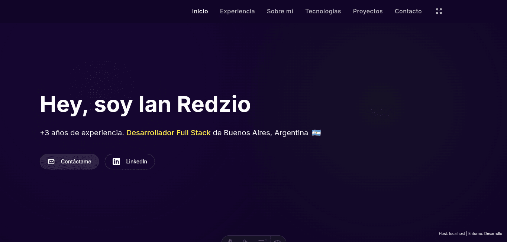

# 🚀 Portfolio Personal - Ian Redzio

Portfolio personal desarrollado con **Astro** y **Tailwind CSS**, presentando mis proyectos, experiencia profesional y habilidades técnicas como Desarrollador Full Stack.

## ✨ Características

- 🌓 **Modo Oscuro/Claro**: Toggle completo con persistencia en localStorage y detección de preferencia del sistema
- 📱 **Diseño Responsivo**: Optimizado para todos los dispositivos (móvil, tablet, desktop)
- ⚡ **Rendimiento Optimizado**: Construido con Astro para máxima velocidad de carga
- 🎨 **Animaciones Suaves**: Transiciones fluidas y efectos hover interactivos
- ♿ **Accesibilidad**: Focus states, aria-labels y navegación por teclado
- 📄 **Descarga de CV**: Botón integrado para descargar curriculum vitae
- 🔍 **SEO Optimizado**: Meta tags y estructura semántica

## 🛠️ Tecnologías Utilizadas

### Frontend
- **[Astro](https://astro.build/)** - Framework web moderno para sitios estáticos
- **[Tailwind CSS](https://tailwindcss.com/)** - Framework CSS utility-first
- **[TypeScript](https://www.typescriptlang.org/)** - Superset tipado de JavaScript
- **[Simple Icons](https://simpleicons.org/)** - Iconos SVG de tecnologías